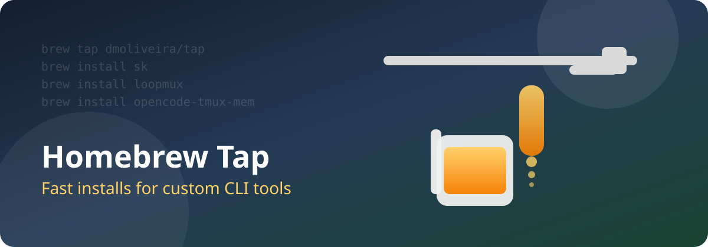

# Homebrew Tap 🍺

<!-- markdownlint-disable MD033 -->
<picture>
  <source srcset="docs/assets/homebrew-tap-hero.webp" type="image/webp">
  
</picture>
<!-- markdownlint-enable MD033 -->

[](https://github.com/dmoliveira/homebrew-tap/actions/workflows/docs-links.yml)
[](https://github.com/dmoliveira/homebrew-tap/actions/workflows/formula-audit.yml)
[](https://github.com/dmoliveira/homebrew-tap/actions/workflows/asset-guard.yml)
[](https://github.com/dmoliveira/homebrew-tap/actions/workflows/pages.yml)
[](https://dmoliveira.github.io/homebrew-tap/)
[](https://github.com/dmoliveira/homebrew-tap)
[](https://github.com/dmoliveira/homebrew-tap/wiki)
[](https://github.com/dmoliveira/homebrew-tap/commits/main)
[](https://github.com/dmoliveira/homebrew-tap/issues)
[](https://github.com/dmoliveira/homebrew-tap/stargazers)
[](LICENSE)
[](docs/support-the-project.md)
[](https://buy.stripe.com/8x200i8bSgVe3Vl3g8bfO00)

This repository is a custom Homebrew tap that ships command-line tools maintained
by `dmoliveira`. It gives you a stable place to install and update formulas that
are not in Homebrew core.

## Maintenance Checks 🛡️

- `Docs Quality Checks`: validates Markdown links in README and docs.
- `Hero Asset Guard`: validates hero image assets and README picture fallback block.
- Both checks run on pull requests, pushes to `main`, and weekly schedule.
- `Generate README Hero`: manual trigger plus monthly scheduled refresh attempt.
- Local one-command check: `make validate` (or `make ci`).
- Full maintenance guide: `docs/maintenance.md`.

## What Is In This Tap? 🧰

- `Formula/sk.rb`: installs `sk`
- `Formula/loopmux.rb`: installs `loopmux`
- `Formula/opencode-tmux-mem.rb`: installs `opencode-tmux-mem`

## Install 🚀

```bash
brew tap dmoliveira/tap
brew install sk
```

Install another formula:

```bash
brew install loopmux
brew install opencode-tmux-mem
```

## Wiki + Docs 🌐

- GitHub Wiki home: `https://github.com/dmoliveira/homebrew-tap/wiki`
- GitHub Pages docs: `https://dmoliveira.github.io/homebrew-tap/`
- Wiki-ready snippet: `docs/wiki-home.md`

Generate a GPT Image 1.5 hero image (optional):

```bash
./scripts/generate-hero-gpt-image.sh
```

This writes `docs/assets/homebrew-tap-hero.webp` and keeps the SVG as fallback.
When the WebP exists, this README automatically prefers it.
If you prefer GitHub Actions, run `Generate README Hero` from Actions with a
repository secret named `OPENAI_API_KEY`.
Setup path: `Settings -> Secrets and variables -> Actions -> New repository secret`.

## Recent sk Release Highlights 📝

Refresh this section with:

```bash
make release-highlights
```

A weekly workflow also refreshes this block and opens a PR when updates are detected.

<!-- sk-release-highlights:start -->

- `v0.2.1`: sk v0.2.1 (2026-03-01)
  - Tag: `https://github.com/dmoliveira/sk/releases/tag/v0.2.1`
  - PR: `https://github.com/dmoliveira/sk/pull/7`
- `v0.2.0`: v0.2.0 (2026-03-01)
  - Tag: `https://github.com/dmoliveira/sk/releases/tag/v0.2.0`
  - PR: `https://github.com/dmoliveira/sk/pull/3`

<!-- sk-release-highlights:end -->

## Support And Donations 💛

- Support details: `docs/support-the-project.md`
- GitHub Sponsors: `https://github.com/sponsors/dmoliveira`
- Donate now via Stripe: [Support Homebrew Tap](https://buy.stripe.com/8x200i8bSgVe3Vl3g8bfO00)

## What Would Make This Page Better? ✨

- Add install analytics per formula (optional privacy-safe counters)
- Publish a compatibility matrix by macOS + CPU architecture
- Add copy-paste troubleshooting cards for common Homebrew errors
- Include release highlights for each new formula version

## License 📄

Released under the MIT License. See `LICENSE`.
